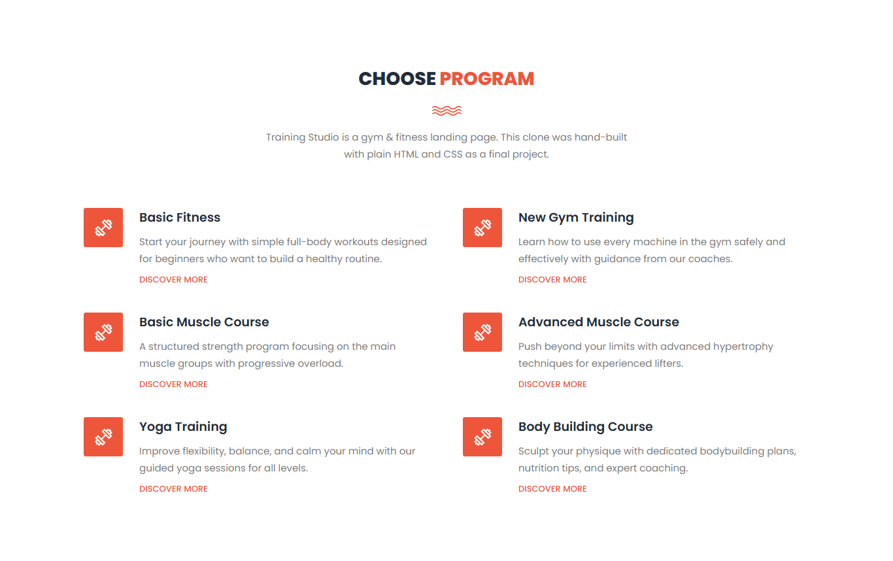
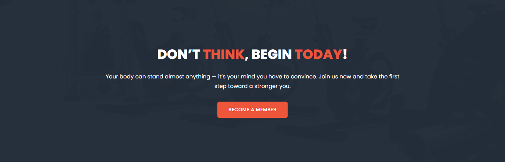
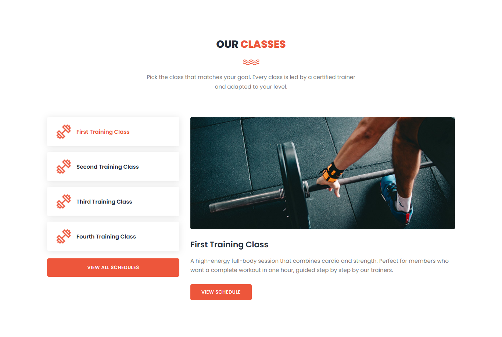
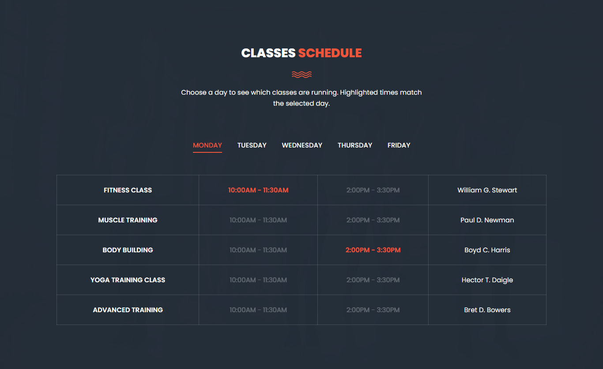
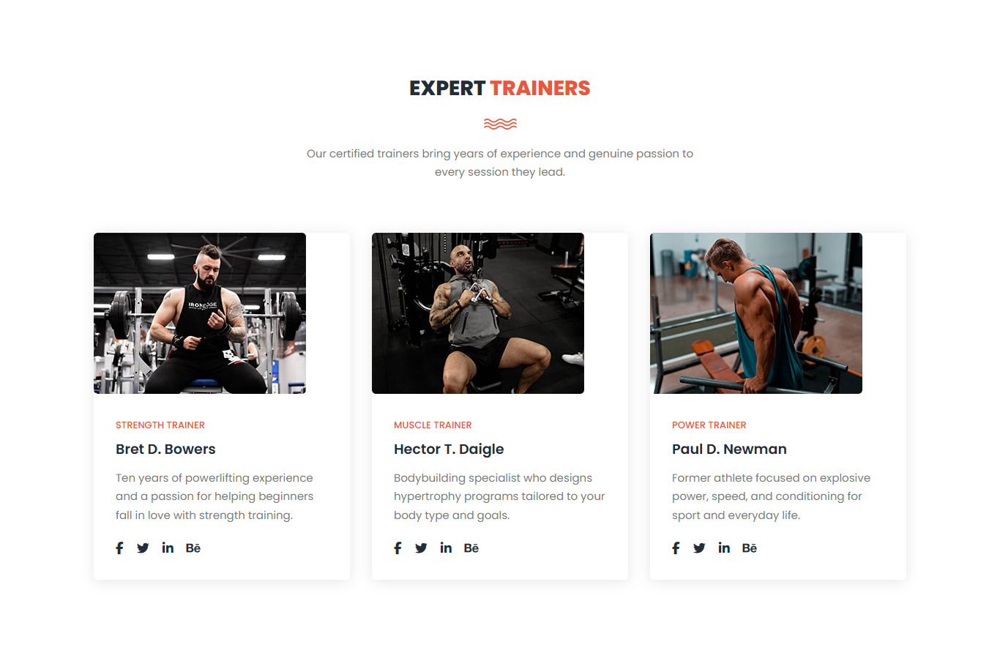
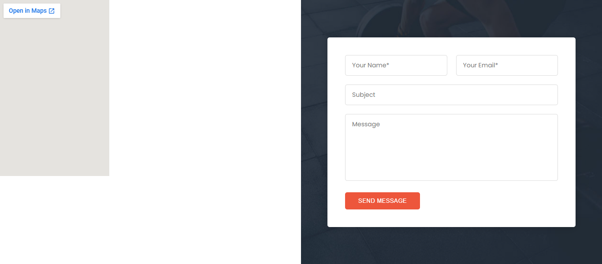
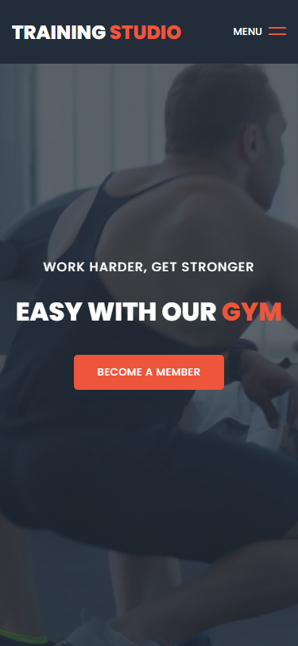
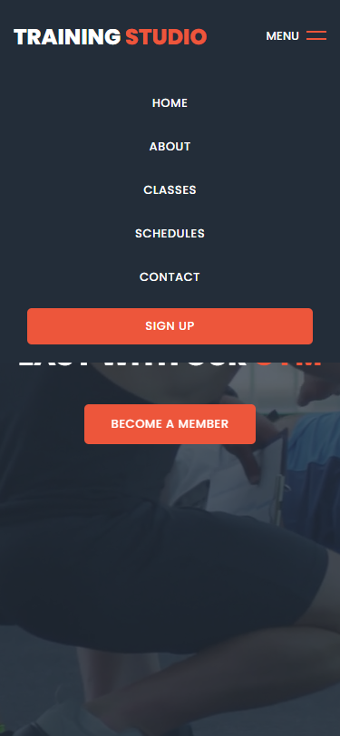
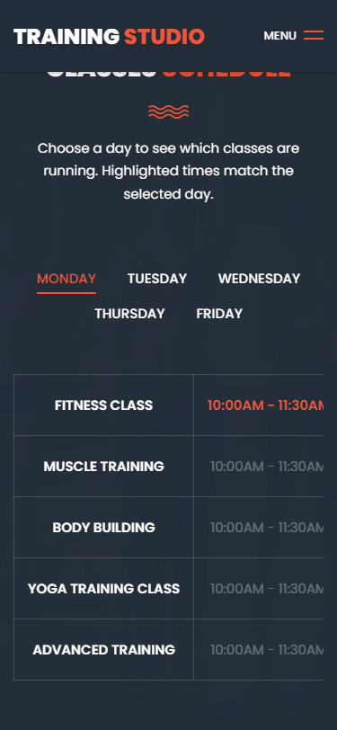
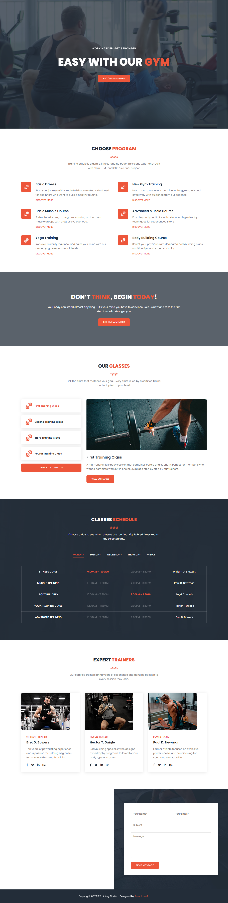

# Training Studio — Landing Page Clone

Final HTML & CSS project: a clone of the [Training Studio](https://templatemo.com/live/templatemo_548_training_studio) template by TemplateMo, rebuilt from scratch with plain **HTML**, **CSS**, and a small amount of **vanilla JavaScript** — no Bootstrap, no jQuery.

## Features

- Sticky navigation bar that turns solid after scrolling
- Fullscreen hero banner with autoplay background video
- "Choose Program" section with a responsive 2-column grid
- Call-to-action banner with a fixed parallax background
- "Our Classes" section with working tabs
- "Classes Schedule" table with a day filter (Monday–Friday)
- "Expert Trainers" cards with Font Awesome social icons
- Contact section with an embedded Google Map and a styled form
- Fully responsive: desktop, tablet, and mobile with a hamburger menu

## Built With

- HTML5
- CSS3 (Flexbox & Grid)
- Vanilla JavaScript
- [Poppins](https://fonts.google.com/specimen/Poppins) font from Google Fonts
- [Font Awesome](https://fontawesome.com/) icons

## Project Structure

```
Final/
├── index.html
├── css/style.css
├── js/main.js
├── assets/images/
└── screenshots/
```

## How to Run

Just open `index.html` in any browser, or serve the folder with any static server:

```
npx http-server . -p 8080
```

## Screenshots

### Hero Banner


### Choose Program



### Call to Action



### Our Classes (Tabs)



### Classes Schedule (Day Filter)



### Expert Trainers



### Contact (Map + Form)



## Responsiveness (Mobile 375px)

| Mobile Hero | Mobile Menu | Mobile Schedule |
| :---: | :---: | :---: |
|  |  |  |

## Full Page

<details>
<summary>Click to view the full desktop page</summary>



</details>

## Credits

- Original design: [TemplateMo 548 Training Studio](https://templatemo.com/tm-548-training-studio)
- Images and video: [Pexels](https://www.pexels.com)
